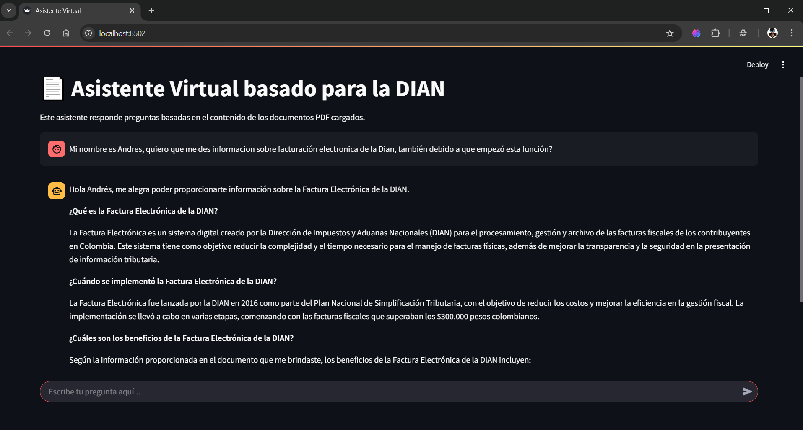

# AgentDian
Desarrollo de implementación de un asistente virtual para el proceso de facturas electrónicas y soporte en la Dian.
## Instalación en Local:
```bash
pip install -r requirements.txt
```
> **Nota:** Asegúrate de tener la versión de Python 3.12.


- <b>CUDA</b> y <b>pytorch</b> son necesarios para correr los modelos de hugginfance localmente, para esto necesitaremos una extension adicional de Microsoft (Visual C++ Redistributable)
que nos permitira tener compatibilidad y comunicacion entre el modelo y nuestra version de pytorch y CUDA las cuales fueron instaladas en requirements.txt.

- Instala el paquete proporcionado por Microsoft en: https://learn.microsoft.com/en-us/cpp/windows/latest-supported-vc-redist.

- El computar se reiniciara y ya podremos utilizar los modelos en local de Hugginface, en este caso nuestro modelos para embeddings "sentence-transformers/all-mpnet-base-v2".

### Modelo:
- Instalar el entorno de ejecucion de modelos que ofrece ollama en: https://ollama.com/ <br>
- Luego realizaremos un pull del modelo que queremos utilizar:
```bash
ollama pull hf.co/bartowski/Meta-Llama-3.1-8B-Instruct-GGUF:IQ4_NL
```
Luego usaremos el jupyter del proyecto, para comprobar la instalacion del modelo llm, y <br>
incluido podremos intalar el modelo nlp para la codificacion de los embeddings.
```python
from langchain_huggingface import HuggingFaceEmbeddings
embeddings = HuggingFaceEmbeddings(model_name="sentence-transformers/all-mpnet-base-v2")
```
# EJECUCION:
Para ejecutar nuestro Chatbot, tendremos que usar el siguiente comando:
```bash
streamlit run app.py --server.port 8502
```

### Colaboradores:

- Andres Felipe Ramos Rojas <br>
- Verónica Ruíz Bautista
- Samuel Alvarez
