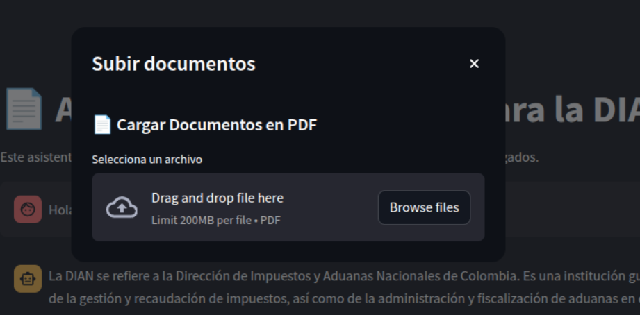

# AgentDian

La aplicación consiste en un `ChatBot` implementadoun asistente virtual que ayude a respondes preguntas y ser de guía en el proceso de facturación de la DIAN en base a documentos ya quemados y que el usuario puede agregar para que el asistente tenga más conocimientos.

Se usa una Base de Dactos Vectorial como `ChromaDB`para 
alamacenar la información de los documentos par que el modelo este en capacida de responder preguntas. Esto se logro usando a `LangChain` para trabajar en una arquitectura `RAG` y poder configurar facilmente el modelo para la tarea de responder preguntas en base a los documentos, específicamente en temas relacionados con la DIAN.

Para el desarrollo de la interfaz gráfica se uso enteramente `Streamlit` gracias a su facilidad para crear interfaces intuitivas, amigables y de rápido desarrollo.


## Instrucciones de instalación:

> **Nota:** Asegúrate de tener la versión de Python 3.12.

Clona este repositorio con 

```bash 
git clone https://github.com/ANDRESRAMOSR20/AgentDian.git
```

Va a la carpeta del proyecto con:
```bash
cd AgentDian
```

Crea un entorno virtual con:

```bash
python -m venv  ./
```

Descarga las dependencias necesarios:

```bash
pip install -r requirements.txt
```

Se requiere de un modelo en local usando Ollama, en caso de no 
tenerlo descargalo [aqu](https://ollama.com/). Y usa el modelo
con:

```bash
ollama pull hf.co/bartowski/Meta-Llama-3.1-8B-Instruct-GGUF:IQ4_NL
```

Para comprobar que el modelo esta funcionando ve al siguiente archivo:


Haz click en el boton:


Deberia dar una respuesta como lo siguiente:


> **Nota:** En caso de errores ve al siguiente apartado para instalación de dependencias. 

Y ejecuta la aplicación con:

```bash
streamlit run app.py
```

----
----

## Dependencias, librerias usadas y requesitos de ejecución

Las librerias usadas para el proyecto que se 
encuentran en el archivo **requirements.txt** son:
   * streamlit
   * PyPDF2
   * python-docx
   * langchain (0.3.17)
   *  langchain-chroma (0.2.1)
   * langchain-community (0.3.16)
   * langchain-core (0.3.33)
   * langchain-huggingface (0.1.2)
   * langchain-ollama (0.2.3)
   * langchain-text-splitters (0.3.5)
   * langgraph (0.2.69)
   * langgraph-checkpoint (2.0.10)
   * langgraph-sdk (0.1.51)
   * langsmith (0.3.4)
   * pdfplumber
  
Se requiere tener dependencias como `Cmake`, `gcc`,`CUDA`  y `c++`. En caso de no tenerlas puedes instarlas con:


### WIndows
Instala desde las páginas principales de [Cmake](https://cmake.org/download/), [gcc](https://gcc.gnu.org/install/binaries.html), [CUDA](https://docs.nvidia.com/cuda/cuda-installation-guide-microsoft-windows/) y [C++](https://visualstudio.microsoft.com/es/vs/features/cplusplus/)

### Linux/Unix🐧


**Base Debian**:

```bash
wget https://developer.download.nvidia.com/compute/cuda/repos/ubuntu2004/x86_64/cuda-ubuntu2004.pin
sudo mv cuda-ubuntu2004.pin /etc/apt/sources.list.d/cuda.list
sudo apt-key adv --fetch-keys https://developer.download.nvidia.com/compute/cuda/repos/ubuntu2004/x86_64/7fa2af80.pub
sudo apt update
sudo apt install cuda cmake build-essential #incluye gcc y c++

```

**Base Fedora/RHEL**:

```bash
sudo dnf install cmake gcc-c++
```

Para instalar **CUDA** haz lo siguiente:

```bash
wget https://developer.download.nvidia.com/compute/cuda/12.8.0/local_installers/cuda_12.8.0_570.86.10_linux.run
sudo sh cuda_12.8.0_570.86.10_linux.run
```


**Base Arch Linux**:

```bash
sudo pacman -S cmake base-devel cuda #incluye gcc y c++
```

**Sistemas con gestor o repositorio de Nix como NixOs**:

```bash
nix-env -iA nixpkgs.cmake nixpkgs.gcc nixpkgs.gnumake nixpkgs.cudatoolkit
```

Desde el archivo `/etc/nixos/configuration.nix` sería:

```bash
environment.systemPackages = with pkgs; [
  gcc
  gnumake
  cmake
  cudatoolkit
];
```

La aplicación requiere de mínimo si se usa GPU o tarjeta gráfica **4 GB de VRAM**. Para el uso de CPU y RAM es recomendable tener un procesador de **4 núcleos** o más a una **frecuencia mínina de 2.6 GHz** y **16 GB de RAM**.

---
---


## Ejecución y ejemplos de uso

Al ejecutar la aplicación se desplegará una pestaña en al navegador por defecto del Sistema Operativo en donde veras algo como lo siguiente:


Recordar que el modelo viene con información necesaria para responder preguntas sobre procesos y dudas sobre la DIAN como se ve en la imagen:


La aplicacición permite buscar documentos.


Buscamos con un tema en específico como por ejemplo legalidad.


También permite agregar nuevos documentos con extensión `PDF` en donde cabe aclarar que para facilidad de lectura por parte del modelo, los documentos se separan en **Chunks**.




Seleccionamos un documento de nuestra computadora:


Y ahora lo cargamos a la aplicacición:


Rectificamos buscando un tema relacionado con el documento cargado, en mi caso sensores:


Y ahora el modelo está en la capacidad de contestar preguntas en relación a temas del documento cargado:


----
----
## Modelos usados

Para la parte de los `embeddings` se usa el modelo [sentence-transformers/all-mpnet-base-v2](https://huggingface.co/sentence-transformers/all-mpnet-base-v2) para clasificar los **Chukns** de los documentos y buscar respuestas similares.En el caso **ChatBot** se uso el modelo de [meta-llama/Llama-3.1-8B-Instruct](https://huggingface.co/meta-llama/Llama-3.1-8B-Instruct).

Estos modelos fueron escogidos sobre otros por ser relativamente ligeros, ser de código libre y de fácil integración con herramientas como `LangChain` y `Transformers` de **HugginFace**.


----
----

## Flujo de trabajo

La aplicación se baso en el siguiente diagrama de flujo:


----
----

## Reflexión

El desarrollo del proyecto fue todo un desafio en donde se tenía que aplicar muchos conocimientos con respecto a trabajo de modelos, arquitectura RAG, uso de librerías como LangChain, Transformers, Streamlit, y trabajo con BD Vectoriales. Todo esos temas tuvimos que unirlos para dar con un producto, que a nuestro parecer, es profesional y de fácil escalabilidad.

Otro aspecto que también fue un reto es el trabajo en equipo y la asignación de tareas, al principio comenzamos de manera muy desorganizada y con poca clarida de que hacer, y sobre todo, de cómo hacerlo. Pero con el pasar de los días fuímos capaces de trabajar en armonía y asignar las partes que cada integrante debía de hacer.

Finalmente, mencionar que toda esta experiencia fue bastante divertida, emocionante, difícil y que dejo bastante conocimientos en cada uno. Sabemos que está vivencia es lo que ocurre en el día a día de un profesional en cualquier área de desarrollo de sistemas y aplicaciones, y que dicha tarea nos pondrá un escalón más arriba de nuestra meta de ser profesionales con el manejo de modelos, agentes inteligentes y Inteligencias Artificiales.I


----
----

## Guía y explicación del programa

El siguiente link lleva a un video en donde se explica un poco más del contexto y razón de la aplicación, así como un **tour** más interactivo al programa [aqui](https://youtu.be/OKOpMOqt0Vs)


----
----

## Colaboradores:

- Andres Felipe Ramos Rojas 
- Verónica Ruíz Bautista
- Samuel Alvarez
- Juan Pablo Montoya Valencia
