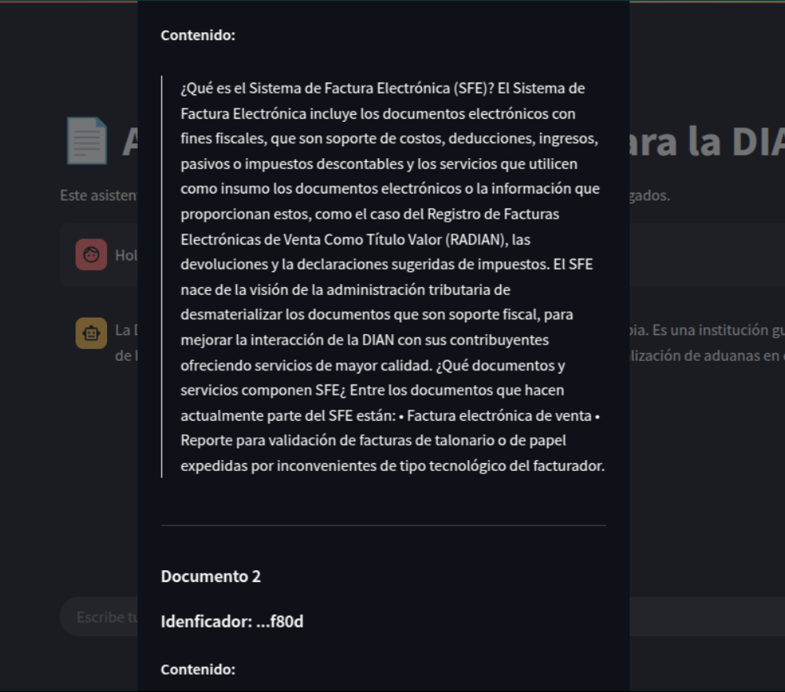
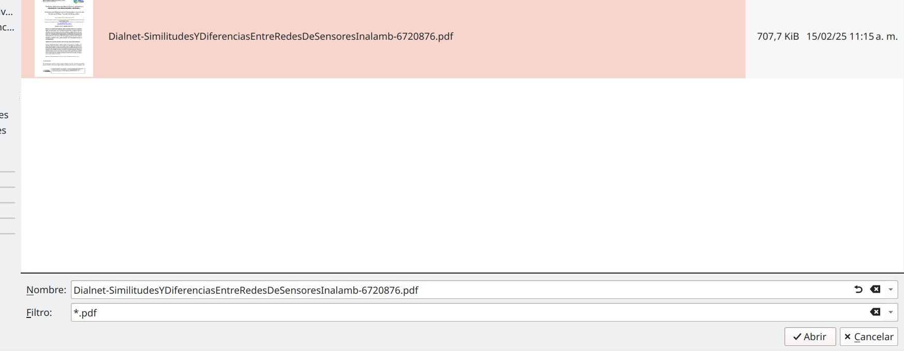
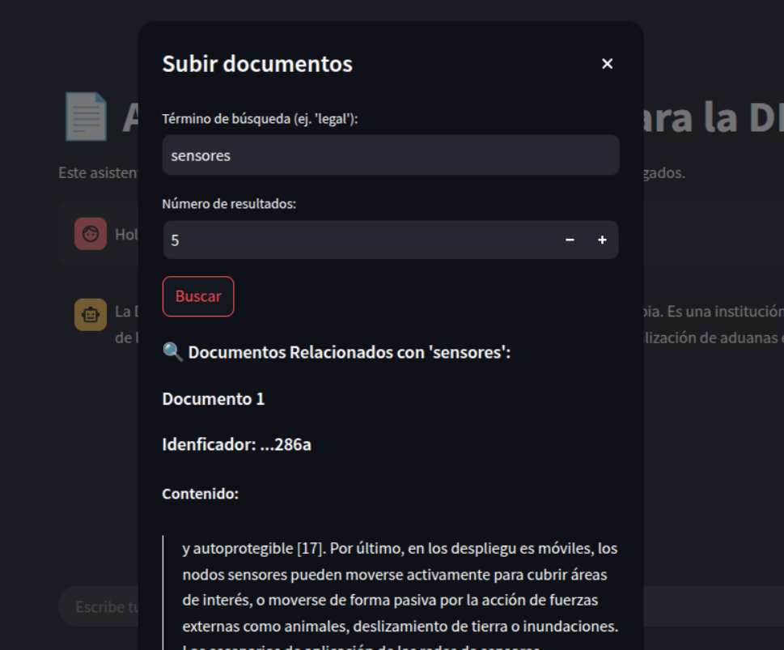
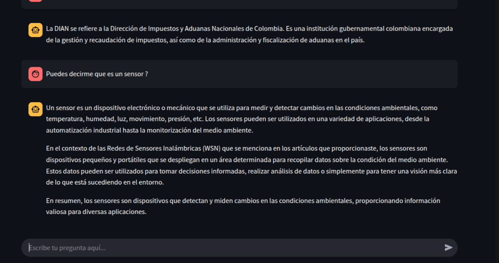

# AgentDian

**AgentDian** is a virtual assistant chatbot designed to help users understand and navigate the electronic invoicing processes of **DIAN** (Colombia’s National Tax and Customs Directorate). It uses preloaded documentation and allows users to upload additional documents to improve its knowledge base.

The application leverages a **vector database** (ChromaDB) to store information extracted from documents, enabling the model to answer user queries effectively. This functionality is achieved using **LangChain** in a **RAG (Retrieval-Augmented Generation)** architecture, making it easy to configure the model for document-based question answering, particularly for DIAN-related topics.

The entire user interface is built using **Streamlit**, which provides a quick and intuitive way to develop user-friendly applications.

---

## Installation Instructions

> **Note:** Ensure you have **Python 3.12** installed.

Clone this repository:

```bash
git clone https://github.com/ANDRESRAMOSR20/AgentDian.git
```

Navigate to the project directory:

```bash
cd AgentDian
```

Create a virtual environment:

```bash
python -m venv ./
```

Install the required dependencies:

```bash
pip install -r requirements.txt
```

This project requires a local model using **Ollama**. If you haven’t installed it, download it [here](https://ollama.com/). Then pull the model using:

```bash
ollama pull hf.co/bartowski/Meta-Llama-3.1-8B-Instruct-GGUF:IQ4_NL
```

To verify that the model is working, open the following file:


Click the button:


You should receive a response similar to the following:


> **Note:** If you encounter any errors, refer to the dependencies section below.

To run the application:

```bash
streamlit run app.py
```

---

## Dependencies and Requirements

All necessary packages are listed in **requirements.txt**, including:

- streamlit  
- PyPDF2  
- python-docx  
- langchain (0.3.17)  
- langchain-chroma (0.2.1)  
- langchain-community (0.3.16)  
- langchain-core (0.3.33)  
- langchain-huggingface (0.1.2)  
- langchain-ollama (0.2.3)  
- langchain-text-splitters (0.3.5)  
- langgraph (0.2.69)  
- langgraph-checkpoint (2.0.10)  
- langgraph-sdk (0.1.51)  
- langsmith (0.3.4)  
- pdfplumber  

Additionally, you'll need `CMake`, `gcc`, `CUDA`, and a `C++` compiler. If not installed, follow the instructions below:

### Windows

Download and install from their official pages:

- [CMake](https://cmake.org/download/)  
- [GCC](https://gcc.gnu.org/install/binaries.html)  
- [CUDA](https://docs.nvidia.com/cuda/cuda-installation-guide-microsoft-windows/)  
- [C++ (Visual Studio)](https://visualstudio.microsoft.com/vs/features/cplusplus/)  

### Linux/Unix 🐧

**Debian-based:**

```bash
wget https://developer.download.nvidia.com/compute/cuda/repos/ubuntu2004/x86_64/cuda-ubuntu2004.pin
sudo mv cuda-ubuntu2004.pin /etc/apt/sources.list.d/cuda.list
sudo apt-key adv --fetch-keys https://developer.download.nvidia.com/compute/cuda/repos/ubuntu2004/x86_64/7fa2af80.pub
sudo apt update
sudo apt install cuda cmake build-essential
```

**Fedora/RHEL-based:**

```bash
sudo dnf install cmake gcc-c++
```

Install **CUDA**:

```bash
wget https://developer.download.nvidia.com/compute/cuda/12.8.0/local_installers/cuda_12.8.0_570.86.10_linux.run
sudo sh cuda_12.8.0_570.86.10_linux.run
```

**Arch Linux-based:**

```bash
sudo pacman -S cmake base-devel cuda
```

**Nix/NixOS:**

```bash
nix-env -iA nixpkgs.cmake nixpkgs.gcc nixpkgs.gnumake nixpkgs.cudatoolkit
```

Or in `/etc/nixos/configuration.nix`:

```nix
environment.systemPackages = with pkgs; [
  gcc
  gnumake
  cmake
  cudatoolkit
];
```

> **Hardware requirements:**  
- GPU: Minimum **4 GB VRAM**  
- CPU: At least **4 cores @ 2.6 GHz**  
- RAM: **16 GB or more** recommended

---

## Usage & Demonstration

When you launch the app, it opens in your browser and looks like this:


It’s preloaded with DIAN-related information to assist with common questions:


You can also search existing documents:


For instance, you might search for legal information:

  


You can upload new `PDF` documents as well. The system splits them into **chunks** for better understanding:

  


Select a file from your machine:



And upload it to the app:


You can then query the chatbot about topics in the uploaded document. In this example, the document was about sensors:



The chatbot is now able to answer questions specific to the newly uploaded content:



---

## Models Used

- **Embeddings Model:** [sentence-transformers/all-mpnet-base-v2](https://huggingface.co/sentence-transformers/all-mpnet-base-v2) for document chunk classification and semantic search.
- **ChatBot Model:** [meta-llama/Llama-3.1-8B-Instruct](https://huggingface.co/meta-llama/Llama-3.1-8B-Instruct)

These models were chosen for their open-source nature, lightweight architecture, and seamless integration with tools like **LangChain** and **Transformers** from HuggingFace.

---

## Workflow Diagram

The following flowchart outlines the architecture of the application:


---

## Reflection

This project was a significant challenge that required a deep understanding of machine learning models, RAG architecture, and the integration of multiple libraries like **LangChain**, **Transformers**, **Streamlit**, and **vector databases**.

Teamwork and task delegation were also critical components. Initially, the team lacked structure and clarity. However, as development progressed, we successfully coordinated and distributed responsibilities effectively.

Overall, it was a fun, exciting, and educational journey that mirrors the real-world work of professionals in the AI and software development space. We believe this experience will serve as a stepping stone toward our goal of becoming experts in intelligent agents and artificial intelligence.

---

## Program Tour and Video Guide

A video overview of the application, including context and a guided walkthrough, is available [here](https://youtu.be/OKOpMOqt0Vs)

---

## Contributors

- Andres Felipe Ramos Rojas  
- Verónica Ruíz Bautista  
- Samuel Alvarez  
- Juan Pablo Montoya Valencia  
